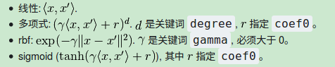

# 利用 sklearn SVM 分类器对 IRIS 数据集分类

支持向量机（SVM）是一种最大化分类间隔的线性分类器（如果不考虑核函数）。通过使用核函数可以用于非线性分类。SVM 是一种判别模型，既适用于分类也适用于回归问题，标准的 SVM 是二分类器，可以采用 “one vs one” 或 “one vs rest” 策略解决多分类问题。

相关原理推导参考：

https://blog.csdn.net/v_JULY_v/article/details/7624837
https://wizardforcel.gitbooks.io/dm-algo-top10/content/svm-1.html
https://charlesliuyx.github.io/2017/09/19/%E6%94%AF%E6%8C%81%E5%90%91%E9%87%8F%E6%9C%BASVM%E5%AD%A6%E4%B9%A0%E7%AC%94%E8%AE%B0/

sklearn 工具包提供了用于二分类或多分类以及回归的实现。参考：http://sklearn.apachecn.org/cn/0.19.0/modules/svm.html#svm-kernels

例如：

```python
from sklearn import svm
clf = svm.SVC(attr_name1=value1, ...)
clf.fit(X,Y)
y_predict = clf.predict(y_test)
```

其中，构造器中常用的参数有：

C : 惩罚系数（默认为 1.0）

kernel : "rbf" | "linear" | "poly" | "sigmoid" | ... (默认为“rbf”)



probability : Ture | False (默认为False)

decision_function_shape : "ovr" | "ovo"  (默认为“ovr”)

分别采用 linear 和 rbf 核对 IRIS 数据集进行分类，采用“one vs one”策略。

```python
# -*- coding: utf-8 -*-
from sklearn import datasets
from sklearn import svm
import numpy as np

if __name__ == '__main__':

    iris = datasets.load_iris() 
    print(type(iris), dir(iris))

    x = iris.get('data')
    y = iris.get('target')

    # 随机划分训练集和测试集
    num = x.shape[0] # 样本总数
    ratio = 7/3 # 划分比例，训练集数目:测试集数目
    num_test = int(num/(1+ratio)) # 测试集样本数目
    num_train = num -  num_test # 训练集样本数目
    index = np.arange(num) # 产生样本标号
    np.random.shuffle(index) # 洗牌
    x_test = x[index[:num_test],:] # 取出洗牌后前 num_test 作为测试集
    y_test = y[index[:num_test]]
    x_train = x[index[num_test:],:] # 剩余作为训练集
    y_train = y[index[num_test:]]

    clf_linear = svm.SVC(decision_function_shape="ovo", kernel="linear")
    clf_rbf = svm.SVC(decision_function_shape="ovo", kernel="rbf")
    clf_linear.fit(x_train, y_train)
    clf_rbf.fit(x_train, y_train)

    y_test_pre_linear = clf_linear.predict(x_test)
    y_test_pre_rbf = clf_rbf.predict(x_test)

    
    # 计算分类准确率
    acc_linear = sum(y_test_pre_linear==y_test)/num_test
    print('linear kernel: The accuracy is', acc_linear) 
    acc_rbf = sum(y_test_pre_rbf==y_test)/num_test
    print('rbf kernel: The accuracy is', acc_rbf) 
```


